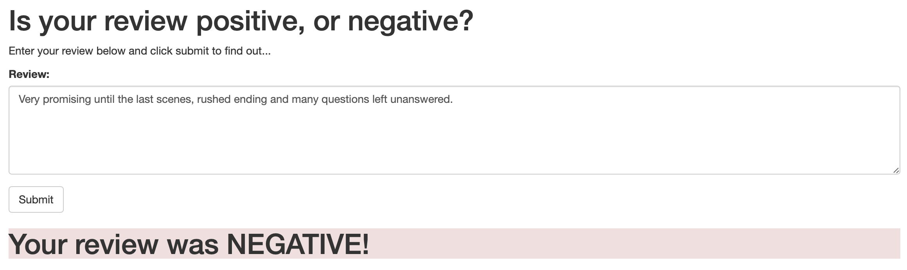
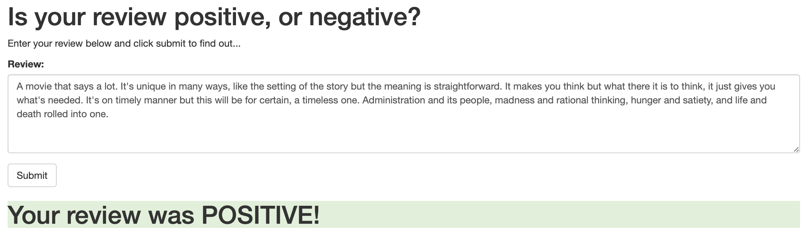

# Sentiment Analysis of IMDb Reviews using a Recurrent Neural Network (RNN)


## Table Of Contents


- [Introduction](#introduction)
- [Setup Instructions](#setup-instructions)
  * [Log in to the AWS console and create a notebook instance](#log-in-to-the-aws-console-and-create-a-notebook-instance)
  * [Use git to clone the repository into the notebook instance](#use-git-to-clone-the-repository-into-the-notebook-instance)
- [Machine Learning Pipeline](#machine-learning-pipeline)
  * [Step 1 - Data collection](#step-1---data-collection)
  * [Step 2 - Data cleaning](#step-2---data-cleaning)
  * [Step 3 - Feature labelling](#step-3---feature-labelling)
  * [Step 4 - Uploading processed data to S3](#step-4---uploading-processed-data-to-s3)
  * [Step 5 - Building and training the PyTorch model](#step-5---building-and-training-the-pytorch-model)
  * [Step 6 - Deploying the trained model for testing](#step-6---deploying-the-trained-model-for-testing)
  * [Step 7 - Model validation using a batch transform job](#step-7---model-validation-using-a-batch-transform-job)
  * [Step 8 - Using the deployed model for the web application](#step-8---using-the-deployed-model-for-the-web-application)
    + [Part A - Declaring an IAM Role for the Lambda function](#part-a---declaring-an-iam-role-for-the-lambda-function)
    + [Part B - Creating a Lambda function](#part-b---creating-a-lambda-function)
    + [Part C - Setting up the API Gateway](#part-c---setting-up-the-api-gateway)
    + [Part D - Deploying the web application](#part-d---deploying-the-web-application)
  * [Important - Deleting the endpoint](#important---deleting-the-endpoint)


## Introduction


For this project, I trained a [Recurrent Neural Network (RNN)](https://en.wikipedia.org/wiki/Recurrent_neural_network) to take in movie reviews as input and output a score rounded to '1' or '0' signifying if the movie was positive negative, respectively. Everything for this project was done on Amazon Web Services (AWS) and their SageMaker platform as the goal of this project was to familiarize myself with the AWS ecosystem.


Prior to training this neural net, I also trained an [XGBoost](https://en.wikipedia.org/wiki/XGBoost) model, mostly just to see which one of the two models would perform better - the resulting scores were not sufficiently different that I could draw any meaningful conclusions, but XGBoost did slightly outperform the neural net. This could be due to a number of factors and it's quite possible that the neural net would perform better under different conditions (i.e. a larger training set, better tuned hyperparameters, or different ratios of training/validation/testing datasets).


Another component of this project was an online form that can be used to pass inputs to the model to test it out. The diagram below illustrates the flow of input from the web application to the model hosted on AWS, which is called using a Lambda function via a REST API. After the predictor performs inference on the given input, it is returned to the web application via the Lambda function.


## Setup Instructions


The notebook in this repository is intended to be executed using Amazon's SageMaker platform and the following is a brief set of instructions on setting up a managed notebook instance using SageMaker.


### Log in to the AWS console and create a notebook instance


Log in to the AWS console and go to the SageMaker dashboard. Click on 'Create notebook instance'. The notebook name can be anything and using ml.t2.medium is a good idea as it is covered under the free tier. For the role, creating a new role works fine. Using the default options is also okay. Important to note that you need the notebook instance to have access to S3 resources, which it does by default. In particular, any S3 bucket or object with 'sagemaker' in the name is available to the notebook.


### Use git to clone the repository into the notebook instance


Once the instance has been started and is accessible, click on 'Open Jupyter' to get to the Jupyter notebook main page. To start, clone this repository into the notebook instance.


Click on the 'new' dropdown menu and select 'terminal'. By default, the working directory of the terminal instance is the home directory, however, the Jupyter notebook hub's root directory is under 'SageMaker'. Enter the appropriate directory and clone the repository as follows.


```
cd SageMaker
git clone https://github.com/Supearnesh/ml-imdb-rnn.git
exit
```


After you have finished, close the terminal window.


## Machine Learning Pipeline


This was the general outline followed for this SageMaker project:


* 1. Data collection
* 2. Data cleaning
* 3. Feature labelling
* 4. Uploading processed data to S3
* 5. PyTorch model - building and training
* 6. Deploying the trained model for testing
* 7. Model validation using a batch transform job
* 8. Using the deployed model for the web application
    * a. Declaring an IAM Role for the Lambda function
    * b. Creating a Lambda function
    * c. Setting up the API Gateway
    * d. Deploying the web application
* 9. Important: Deleting the endpoint


### Step 1 - Data collection


The [IMDb dataset](http://ai.stanford.edu/~amaas/data/sentiment/) contains 25,000 of each positive and negative IMDb reviews, which were used to train this model.


> Maas, Andrew L., et al. [Learning Word Vectors for Sentiment Analysis](http://ai.stanford.edu/~amaas/data/sentiment/). In _Proceedings of the 49th Annual Meeting of the Association for Computational Linguistics: Human Language Technologies_. Association for Computational Linguistics, 2011.


```python
%mkdir ../data
!wget -O ../data/aclImdb_v1.tar.gz http://ai.stanford.edu/~amaas/data/sentiment/aclImdb_v1.tar.gz
!tar -zxf ../data/aclImdb_v1.tar.gz -C ../data
```

    --2020-04-21 02:13:38--  http://ai.stanford.edu/~amaas/data/sentiment/aclImdb_v1.tar.gz
    Resolving ai.stanford.edu (ai.stanford.edu)... 171.64.68.10
    Connecting to ai.stanford.edu (ai.stanford.edu)|171.64.68.10|:80... connected.
    HTTP request sent, awaiting response... 200 OK
    Length: 84125825 (80M) [application/x-gzip]
    Saving to: ‘../data/aclImdb_v1.tar.gz’
    
    ../data/aclImdb_v1. 100%[===================>]  80.23M  23.1MB/s    in 4.2s
    
    2020-04-21 02:13:42 (19.0 MB/s) - ‘../data/aclImdb_v1.tar.gz’ saved [84125825/84125825]


### Step 2 - Data cleaning


It is necessary to perform some initial data processing, as well as separate the training and testing datasets. Much to my chagrin, a validation dataset was not allocated in this step.


```python
import os
import glob

def read_imdb_data(data_dir='../data/aclImdb'):
    data = {}
    labels = {}
    
    for data_type in ['train', 'test']:
        data[data_type] = {}
        labels[data_type] = {}
        
        for sentiment in ['pos', 'neg']:
            data[data_type][sentiment] = []
            labels[data_type][sentiment] = []
            
            path = os.path.join(data_dir, data_type, sentiment, '*.txt')
            files = glob.glob(path)
            
            for f in files:
                with open(f) as review:
                    data[data_type][sentiment].append(review.read())
                    # Here we represent a positive review by '1' and a negative review by '0'
                    labels[data_type][sentiment].append(1 if sentiment == 'pos' else 0)
                    
            assert len(data[data_type][sentiment]) == len(labels[data_type][sentiment]), \
                    "{}/{} data size does not match labels size".format(data_type, sentiment)
                
    return data, labels
```


```python
data, labels = read_imdb_data()
print("IMDb reviews: train = {} pos / {} neg, test = {} pos / {} neg".format(
            len(data['train']['pos']), len(data['train']['neg']),
            len(data['test']['pos']), len(data['test']['neg'])))
```

    IMDb reviews: train = 12500 pos / 12500 neg, test = 12500 pos / 12500 neg


After the raw data has been separated into the respective training and testing sets, they need to be shuffled in order to randomize the data.


```python
from sklearn.utils import shuffle

def prepare_imdb_data(data, labels):
    """Prepare training and test sets from IMDb movie reviews."""
    
    #Combine positive and negative reviews and labels
    data_train = data['train']['pos'] + data['train']['neg']
    data_test = data['test']['pos'] + data['test']['neg']
    labels_train = labels['train']['pos'] + labels['train']['neg']
    labels_test = labels['test']['pos'] + labels['test']['neg']
    
    #Shuffle reviews and corresponding labels within training and test sets
    data_train, labels_train = shuffle(data_train, labels_train)
    data_test, labels_test = shuffle(data_test, labels_test)
    
    # Return a unified training data, test data, training labels, test labels
    return data_train, data_test, labels_train, labels_test
```


```python
train_X, test_X, train_y, test_y = prepare_imdb_data(data, labels)
print("IMDb reviews (combined): train = {}, test = {}".format(len(train_X), len(test_X)))
```

    IMDb reviews (combined): train = 25000, test = 25000


Once the datasets have been combined and shuffled, the data still needs to be cleaned. For instance, various HTML tags and other inconsistencies may exist that can interfere with the training of the neural net. The code below converts all letters should to lowercase and removes any stopwords (e.g. "the", "a", "an", "in") from the reviews. It also removes excess punctuation, spaces, and other symbols. Additionally, `BeautifulSoup` gets rid of any HTML tags and `nltk` is used to tokenize the reviews.


```python
import nltk
from nltk.corpus import stopwords
from nltk.stem.porter import *

import re
from bs4 import BeautifulSoup

def review_to_words(review):
    nltk.download("stopwords", quiet=True)
    stemmer = PorterStemmer()
    
    text = BeautifulSoup(review, "html.parser").get_text() # Remove HTML tags
    text = re.sub(r"[^a-zA-Z0-9]", " ", text.lower()) # Convert to lower case
    words = text.split() # Split string into words
    words = [w for w in words if w not in stopwords.words("english")] # Remove stopwords
    words = [PorterStemmer().stem(w) for w in words] # stem
    
    return words
```


The most important thing being done above is the utilization of `PorterStemmer` to group words of the same 'stem' into buckets for training the neural net. This effectively converts words like *dramatic* and *dramatized* into *drama* so they are treated equally for sentiment analysis purposes.


### Step 3 - Feature labelling


For the model to read the input and make effective decisions about each review, a few tasks need to be completed. First, a vocabulary needs to be constructed which contains *5,000* of the most frequently occurring words across all reviews in the training dataset. Second, each review needs to be represented as an array of *5,000* integers based on how many times each word in the vocabulary occurs in the current example. Third, the reviews need to be standardized to a fixed length of *500* words so that their arrays contain an equal number of elements.


```python
import numpy as np

def build_dict(data, vocab_size = 5000):
    """Construct and return a dictionary mapping each of the most frequently appearing words to a unique integer."""
    
    # DONE: Determine how often each word appears in `data`. Note that `data` is a list of sentences and that a
    #       sentence is a list of words.
    
    # A dict storing the words that appear in the reviews along with how often they occur
    word_count = {}
    
    for sentence in data:
        for word in sentence:
            if word in word_count:
                word_count[word] += 1
            else:
                word_count[word] = 1
    
    # DONE: Sort the words found in `data` so that sorted_words[0] is the most frequently appearing word and
    #       sorted_words[-1] is the least frequently appearing word.
            
    sorted_words = sorted(word_count, key=word_count.get, reverse=True)
    #print(sorted_words[0])
    #print(sorted_words[-1])
    
    word_dict = {} # This is what we are building, a dictionary that translates words into integers
    for idx, word in enumerate(sorted_words[:vocab_size - 2]): # The -2 is so that we save room for the 'no word'
        word_dict[word] = idx + 2 # 'infrequent' labels
        
    return word_dict
```


```python
word_dict = build_dict(train_X)
```


The above code builds the vocabulary dictionary for our first step. Interestingly, the five most frequently appearing words across the training dataset were ['movi', 'film', 'one', 'like', 'time']. This makes sense since 'movi' (stemmed from 'movie') and 'film' are often referred to in IMDb reviews. Also, the words 'one', 'like', and 'time' are commonly used in the English language in general.


```python
def convert_and_pad(word_dict, sentence, pad=500):
    NOWORD = 0 # We will use 0 to represent the 'no word' category
    INFREQ = 1 # and we use 1 to represent the infrequent words, i.e., words not appearing in word_dict
    
    working_sentence = [NOWORD] * pad
    
    for word_index, word in enumerate(sentence[:pad]):
        if word in word_dict:
            working_sentence[word_index] = word_dict[word]
        else:
            working_sentence[word_index] = INFREQ
            
    return working_sentence, min(len(sentence), pad)

def convert_and_pad_data(word_dict, data, pad=500):
    result = []
    lengths = []
    
    for sentence in data:
        converted, leng = convert_and_pad(word_dict, sentence, pad)
        result.append(converted)
        lengths.append(leng)
        
    return np.array(result), np.array(lengths)
```


```python
train_X, train_X_len = convert_and_pad_data(word_dict, train_X)
test_X, test_X_len = convert_and_pad_data(word_dict, test_X)
```


The above contains our second and third steps merged into one method `convert_and_pad_data()`, it leverages the dictionary created in the previously and applies it to the training and test datasets to represent them as arrays of integers with regards to how many occurrences of each word from the vocabulary dictionary are present in the example being processed.


### Step 4 - Uploading processed data to S3


Now that the training and test datasets are processed, the data must be uploaded to S3 in order to proceed with training the neural net. Fortunately, this is fairly straightforward to do in SageMaker. The training data needs to be uploaded to the default SageMaker S3 bucket so that access can be provided while training the RNN model.


```python
import sagemaker

sagemaker_session = sagemaker.Session()

bucket = sagemaker_session.default_bucket()
prefix = 'sagemaker/sentiment_rnn'

role = sagemaker.get_execution_role()
```


```python
input_data = sagemaker_session.upload_data(path=data_dir, bucket=bucket, key_prefix=prefix)
```


### Step 5 - Building and training the PyTorch model


A model consists of model artifacts, training code, and inference code; each of these components interact with each other. The neural network is implemented in PyTorch using the model object from `model.py`, located in the `train` folder. The implementation is included below.


```python
import torch.nn as nn

class LSTMClassifier(nn.Module):
    """ LSTMClassifier class for initializing the layers for the simple 
    recurrent neural network model (RNN) used for Sentiment Analysis of 
    IMDB reviews.

    Attributes:
        embedding_dim (int) dimensionality of the embedding layer
        hidden_dim (int) dimensionality of the hidden layer(s)
        vocab_size (int) size of the vocabulary used by Bag of Words

    """

    def __init__(self, embedding_dim, hidden_dim, vocab_size):

        super(LSTMClassifier, self).__init__()

        self.embedding = nn.Embedding(vocab_size, embedding_dim, padding_idx=0)
        self.lstm = nn.LSTM(embedding_dim, hidden_dim)
        self.dense = nn.Linear(in_features=hidden_dim, out_features=1)
        self.sig = nn.Sigmoid()
        
        self.word_dict = None


    def forward(self, x):
        """Function to perform a forward pass of the RNN model on some 
        given input.
        
        Args:
            x (array): input used for forward propagation
        
        Returns:
            array: the next layer in the neural network produced by 
                applying the element-wise sigmoid function to the input
        
        """

        x = x.t()
        lengths = x[0,:]
        reviews = x[1:,:]
        embeds = self.embedding(reviews)
        lstm_out, _ = self.lstm(embeds)
        out = self.dense(lstm_out)
        out = out[lengths - 1, range(len(lengths))]
        return self.sig(out.squeeze())
```


A key point to remember is that the parameters included above can be tweaked to increase the performance of the RNN model. In particular, the sizes of the embedding dimension, hidden dimension, and vocabulary array can be changed from here. It is likely that by increasing the vocabulary size we would see improvements in the model but also a higher processing time per record due to `convert_and_pad()` being executed across a larger dictionary.


Now that creation of the model artifacts is accounted for, the training and inference methods remain - the former is below and is similar to the training methods used to train other PyTorch models.


```python
def train(model, train_loader, epochs, optimizer, loss_fn, device):
    for epoch in range(1, epochs + 1):
        model.train()
        total_loss = 0
        for batch in train_loader:
            batch_X, batch_y = batch
            
            batch_X = batch_X.to(device)
            batch_y = batch_y.to(device)
            
            # DONE: Complete this train method to train the model provided.
            optimizer.zero_grad()
            output = model.forward(batch_X)
            loss = loss_fn(output, batch_y)
            loss.backward()
            optimizer.step()
            
            total_loss += loss.data.item()
        print("Epoch: {}, BCELoss: {}".format(epoch, total_loss / len(train_loader)))
```


The above `train()` method comes from `train.py` found in the the `train` folder. To kick off training, the training script is provided to SageMaker to construct the PyTorch model. Depending on the underlying ML instance type used for training, AWS will charge per second of execution. More details can be found at the [SageMaker pricing page](https://aws.amazon.com/sagemaker/pricing).


```python
from sagemaker.pytorch import PyTorch

estimator = PyTorch(entry_point="train.py",
                    source_dir="train",
                    role=role,
                    framework_version='0.4.0',
                    train_instance_count=1,
                    train_instance_type='ml.p2.xlarge',
                    hyperparameters={
                        'epochs': 10,
                        'hidden_dim': 200,
                    })
```


```python
estimator.fit({'training': input_data})
```


### Step 6 - Deploying the trained model for testing


This step could not have been made easier, SageMaker and AWS do all of the heavy lifting here again.


```python
# TODO: Deploy the trained model
predictor = estimator.deploy(initial_instance_count = 1, instance_type = 'ml.m4.xlarge')
```

    ---------------!


### Step 7 - Model validation using a batch transform job


Validating that the trained model is functioning within the expected parameters is straightforward by using the testing dataset that was creating via the data collection and cleaning methods from earlier.


```python
test_X = pd.concat([pd.DataFrame(test_X_len), pd.DataFrame(test_X)], axis=1)
```


```python
# We split the data into chunks and send each chunk separately, accumulating the results.

def predict(data, rows=512):
    split_array = np.array_split(data, int(data.shape[0] / float(rows) + 1))
    predictions = np.array([])
    for array in split_array:
        predictions = np.append(predictions, predictor.predict(array))
    
    return predictions
```


```python
predictions = predict(test_X.values)
predictions = [round(num) for num in predictions]
```


```python
from sklearn.metrics import accuracy_score
accuracy_score(test_y, predictions)
```


    0.83684


The model seems to be performing reasonably well with an accuracy score that is just slightly below that of the XGBoost model experiment from before. Now that the model has been deployed and seems to be in working condition, it can be connected to the web application to start providing results through a more consumer-friendly interface.


### Step 8 - Using the deployed model for the web application


In order to achieve the end-to-end web application deployment shown in the below diagram, usage of additional AWS services is required.


The diagram above gives an overview of how the various services will work together. On the far right is the trained RNN model, deployed using SageMaker. On the far left is the web application that will collect users' movie reviews, send it back to the model, and display the positive or negative response.


The middle is the part that needs to be configured; this consists of constructing a Lambda function which is simply a Python function that is executed when a specified even occurs. This function will have permission to send and receive data from the SageMaker endpoint of the model.


Lastly, the method used to execute the Lambda function is a new endpoint that will be created using API Gateway. This endpoint will be a URL that listens for input, passes that input to the Lambda function, and returns a response from the Lambda function. It acts as the interface for communication between the web application and the Lambda function.


#### Part A - Declaring an IAM Role for the Lambda function


Since the Lambda function needs to communicate with a SageMaker endpoint, it needs to be granted access in order to do so. This can be done by constructing a role that will be given to the Lambda function upon creation.


Using the AWS Console, navigate to the **IAM** page and click on **Roles**. Then, click on **Create role**. Make sure that the **AWS service** is the type of trusted entity selected and choose **Lambda** as the service that will use this role, then click **Next: Permissions**.


In the search box type `sagemaker` and select the check box next to the **AmazonSageMakerFullAccess** policy. Then, click on **Next: Review**.


Lastly, name this role  `LambdaSageMakerRole`. Then, click on **Create role**.


#### Part B - Creating a Lambda function


With an IAM role provisioned, the Lambda function can now be created.


Using the AWS Console, navigate to the AWS Lambda page and click on **Create a function**. On the next page, make sure that **Author from scratch** is selected. Now, name the Lambda function `sentiment_analysis_func`. Make sure that the **Python 3.8** (or the latest version) runtime is selected and then choose the `LambdaSageMakerRole` role that was created in the previous part. Then, click on **Create Function**.


On the next page there will be some information about the Lambda function just created. Upon scrolling down, there will be an editor in which code can be written to execute upon triggering the Lambda function. In this example, use the code below.


```python
# We need to use the low-level library to interact with SageMaker since the SageMaker API
# is not available natively through Lambda.
import boto3

def lambda_handler(event, context):

    # The SageMaker runtime is what allows us to invoke the endpoint that we've created.
    runtime = boto3.Session().client('sagemaker-runtime')

    # Now we use the SageMaker runtime to invoke our endpoint, sending the review we were given
    response = runtime.invoke_endpoint(EndpointName = '**ENDPOINT NAME HERE**',    # The name of the endpoint we created
                                       ContentType = 'text/plain',                 # The data format that is expected
                                       Body = event['body'])                       # The actual review

    # The response is an HTTP response whose body contains the result of our inference
    result = response['Body'].read().decode('utf-8')

    return {
        'statusCode' : 200,
        'headers' : { 'Content-Type' : 'text/plain', 'Access-Control-Allow-Origin' : '*' },
        'body' : result
    }
```


Once the code has been entered into the Lambda code editor, replace the `**ENDPOINT NAME HERE**` portion with the name of the endpoint that was deployed earlier. The name of the endpoint can be displayed by running the code below from Jupyter notebook.


```python
predictor.endpoint
```


    'sagemaker-pytorch-2020-04-21-02-33-39-510'


Once the endpoint name has been added to the Lambda function, click on **Save**. The Lambda function is now up and running. Next the API layer needs to be created for the web app to execute the Lambda function.


#### Part C - Setting up the API Gateway


Now that the Lambda function is set up, a new API using API Gateway needs to be set up to trigger it.


Using AWS Console, navigate to **Amazon API Gateway** and then click on **Get started**.


On the next page, make sure that **New API** is selected and name it `sentiment_analysis_api`. Then, click on **Create API**.


An API has now been created, but it doesn't currently do anything. The goal is to have this API trigger the Lambda function that was created earlier.


Select the **Actions** dropdown menu and click **Create Method**. A new blank method will be created, select its dropdown menu and select **POST**, then click on the check mark beside it.


For the integration point, make sure that **Lambda Function** is selected and click on the **Use Lambda Proxy integration**. This option makes sure that the data that is sent to the API is then sent directly to the Lambda function with no processing. It also means that the return value must be a proper response object as it will also not be processed by API Gateway.


Type the name of the Lambda function `sentiment_analysis_func` into the **Lambda Function** text entry box and click on **Save**. Click on **OK** in the pop-up box that then appears, giving permission to API Gateway to invoke the Lambda function.

The last step in creating the API Gateway is to select the **Actions** dropdown and click on **Deploy API**. A new Deployment stage will need to be created and named `prod`.

The public API to access the SageMaker model has now been set up. Make sure to copy or write down the URL provided to invoke the newly created public API as this will be needed in the next step. This URL can be found at the top of the page, highlighted in blue next to the text **Invoke URL**.


#### Part D - Deploying the web application


The publicly available API can now be used in a web application. For this project's purposes, it is a simple static html file which can make use of the public API created earlier. The `index.html` file located in the `website` folder needs to contain a reference to the public API URL, with which it can subsequently access the Lambda function and the SageMaker endpoint.


> **Important Note** In order for the web app to communicate with the SageMaker endpoint, the endpoint has to actually be deployed and running. This means that someone is paying for the resources to keep it up. Make sure that the endpoint is running when the web app needs to be used but ensure that it is shut down when not needed. Otherwise, there will be a surprisingly large AWS bill at the end of the month.


IMDb Review 1:

*`"Very promising until the last scenes, rushed ending and many questions left unanswered."` - The Platform (2019)*

Expected Output: Your review was NEGATIVE!




IMDb Review 2:

*`"A movie that says a lot. It's unique in many ways, like the setting of the story but the meaning is straightforward. It makes you think but what there it is to think, it just gives you what's needed. It's on timely manner but this will be for certain, a timeless one. Administration and its people, madness and rational thinking, hunger and satiety, and life and death rolled into one."` - Black Mirror: Bandersnatch (2018)*

Expected Output: Your review was POSITIVE!




## Important - Deleting the endpoint


Always remember to shut down the model endpoint if it is no longer being used. AWS charges for the duration that an endpoint is left running, so if it is left on then there could be an unexpectedly large AWS bill.


```python
predictor.delete_endpoint()
```
